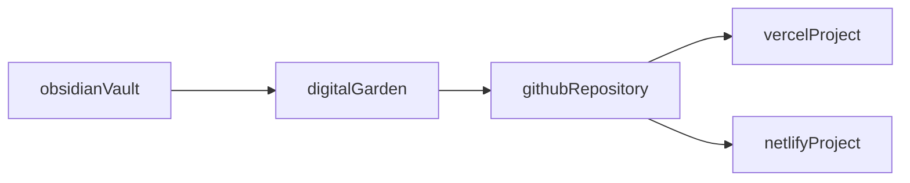

---
{"dg-publish":true,"permalink":"/desplegar-un-digital-garden/"}
---

## Cómo desplegar un digital garden

### Para el hosting

- Tener una cuenta en GitHub
- Tener una cuenta en Vercel
- Entrar a la página del repositorio del template [oleeskild/digitalgarden](https://github.com/oleeskild/digitalgarden) y pulsar el botón Deploy
	- Vercel creará el repositorio en la cuenta de GitHub
	- Tomar nota del nombre del repositorio para ingresarlo luego en la configuración del plugin
- En la cuenta de GitHub, crear un Personal Access Token (PAT) de tipo Fine Grained, con settings como estos:
	- Token Name: 2024-Digital Garden
	- Expiration: Custom: 2025-01-01
	- Description: Publishing content to the digital garden
	- Resource owner: akobashikawa
	- Only select repositories: digital-garden
	- Permissions:
		- Contents: Access: Read and write
		- Pull requests: Access: Read and write
- Generar el PAT y copiarlo a un lugar seguro para ingresarlo luego en la configuración del plugin.

### En la máquina local

- Tener instalado Obsidian
- Crear un nuevo vault, llamado Digital Garden, por ejemplo
- En ese vault, instalar el plugin Digital Garden
- En la configuración de Digital Garden, colocar valores similares a:
	- GitHub Authentication
		- GitHub repo name: digital-garden
		- GitHub Username: akobashikawa
		- GitHub token: github_pat_xxx
			- Es el PAT que se generó en GitHub
	- URL
		- Base URL: https://akc-digital-garden.vercel.app
- Para configurar la apariencia:
	- Features, Global Note Settings, Manage Note Settings

## Cómo hacer el despliegue en otro lugar

- La documentación supone que usamos Vercel, que ofrece un servicio de hosting de sites estáticos gratuito.
- También se puede hacer el despliegue en otro hosting, como Netlify, que ofrece un servicio similar, o en un hosting propio.
	- Para eso hay que adaptar el paso del botón Deploy y, en lugar de eso:
		- En GitHub, crear manualmente un repositorio para el digital garden
			- Por ejemplo: https://github.com/akobashikawa/digital-garden.git
		- En la máquina local, clonar el repositorio del template
			- git clone https://github.com/oleeskild/digitalgarden.git
		- Cambiar el remote para que apunte a nuestro repo, por ejemplo:
			- git remote set-url origin https://github.com/akobashikawa/digital-garden.git
		- En Netlify, importar nuestro repo. En un hosting propio, hay que hacer la configuración del despliegue apropiadamente, por ejemplo con Jenkins.

## Problema para desplegar en Windows

- npm run build
- Al ejecutarlo en Ubuntu 22.04, ok
- Al ejecutarlo en Windows 10 ó Windows Server 19, obtengo:
	- Error in your Eleventy config file '.eleventy.js'
	- Something went wrong installing the "sharp" module
- sharp es usado por:
	- eleventy-img
	- eleventy-plugin-gen-favicons
- Al 20240130, no he logrado solucionar este problema

